# How MSD Embeds Signatures in Files

> A deep dive into embedding cryptographic signatures in images, PDFs, and Office documents

---

## The Big Picture

When you send someone a signed PDF or image, you want two things:

1. **The file should still work** — open in any standard viewer
2. **The signature travels with the file** — no separate `.sig` file to lose

MSD achieves this by embedding signature data *inside* the file format itself, using format-specific metadata mechanisms that standard programs ignore but MSD can extract.

```mermaid
flowchart LR
    subgraph Before
        A[Original File] --> B[Standard Viewer]
    end
    
    subgraph After Signing
        C[Signed File] --> D[Standard Viewer]
        C --> E[MSD Verify]
    end
    
    B --> F[✓ Renders Normally]
    D --> G[✓ Renders Normally]
    E --> H[✓ Signature Valid]
```



**The key insight**: Every major file format has extensible metadata fields. MSD leverages these to store signature data in a way that:
- Doesn't break the file
- Survives most copy/share operations
- Can be reliably extracted for verification

---

## User-Facing API

### Signing a File

```python
import msd_sdk as msd

# Your signing key (Ed25519)
key = msd.load_key("my_key.json")

# Load your file
with open("document.pdf", "rb") as f:
    content = f.read()

# Sign and embed in one step
signed = msd.sign_and_embed(
    data={'type': 'pdf', 'content': content},
    metadata={'author': 'Alice', 'department': 'Engineering'},
    key=key
)

# Save the signed file — it's still a valid PDF!
with open("document_signed.pdf", "wb") as f:
    f.write(signed['content'])
```

### Verifying a File

```python
# Load the signed file
with open("document_signed.pdf", "rb") as f:
    content = f.read()

# Verify in one step
is_valid = msd.verify({'type': 'pdf', 'content': content})
# Returns True if signature matches content, False otherwise
```

### Extracting Metadata

```python
metadata = msd.extract_metadata({'type': 'pdf', 'content': content})
# {'author': 'Alice', 'department': 'Engineering'}
```

### Stripping Signatures

```python
clean = msd.strip_metadata_and_signature({'type': 'pdf', 'content': content})
# Returns the original file without any MSD data
```

---

## Supported File Types

| Type String | Format | Extension | Embedding Mechanism |
|-------------|--------|-----------|---------------------|
| `png` | PNG Image | .png | tEXt/zTXt chunks |
| `jpg` | JPEG Image | .jpg, .jpeg | APP markers / EXIF |
| `pdf` | PDF Document | .pdf | Document metadata |
| `word_document` | Word | .docx | Custom XML parts |
| `excel_document` | Excel | .xlsx | Custom XML parts |
| `powerpoint_document` | PowerPoint | .pptx | Custom XML parts |

---

## How It Works: The Three-Layer Model

MSD file embedding works in three layers:

```
┌─────────────────────────────────────────────────────┐
│                    User API Layer                   │
│  sign_and_embed() / verify() / extract_metadata()   │
├─────────────────────────────────────────────────────┤
│                   Granule Layer                     │
│     Cryptographic signing and verification          │
├─────────────────────────────────────────────────────┤
│                  Embedding Layer                    │
│     Format-specific embedding/extraction            │
└─────────────────────────────────────────────────────┘
```

### Layer 1: User API

The user works with simple Python dicts:

```python
{'type': 'png', 'content': bytes}
```

The SDK handles all complexity internally.

### Layer 2: Granule Layer

MSD's core data unit is the **Granule** — a signed bundle of data:

```python
{
    '__type': 'ET.SignedGranule',
    'data': <the file content>,
    'metadata': {'author': 'Alice', ...},
    'signature_time': {'__type': 'Time', ...},
    'signature': {'__type': 'ET.Ed25519Signature', ...},
    'key': {'__type': 'ET.Ed25519KeyPair', 'public_key': '🔑-...'}
}
```

The signature is computed over:
1. BLAKE3 Merkle hash of the data
2. BLAKE3 Merkle hash of the metadata
3. Timestamp string

### Layer 3: Embedding Layer

The embedding layer uses Zef's format-specific handlers to store granule data:


---

## Deep Dive: The Signing Process

### Step 1: Parse to Typed Representation

```python
# Internal: Python dict → Zef typed object
match data['type']:
    case 'png': typed = zef.PngImage(data['content'])
    case 'jpg': typed = zef.JpgImage(data['content'])
    case 'pdf': typed = zef.PDF(data['content'])
    # ... etc
```

**Why typed representations?**

Zef uses typed wrappers so that:
- The hash of a PNG is computed consistently (format-aware)
- Different formats can have different embedding strategies
- Type information is part of the signed data

### Step 2: Strip Existing Metadata

```python
clean = zef.strip_embedded_data(typed)
```

Before signing, any existing MSD metadata is removed. This ensures:
- Idempotent signing (sign twice = same result)
- Clean content hash (no recursive metadata)

### Step 3: Create Signed Granule

```python
timestamp = zef.now()
granule = zef.create_signed_granule(clean, metadata, timestamp, key)
```

The signature is computed as:

```
signature = Ed25519.sign(
    private_key,
    BLAKE3(data) || BLAKE3(metadata) || timestamp
)
```

Where `||` means concatenation.

### Step 4: Serialize and Embed

```python
# Serialize granule WITHOUT the data field (data is the file itself)
to_embed = granule | zef.remove('data') | zef.to_bytes

# Embed into the file
signed_file = zef.embed_data(typed, to_embed)
```

**Critical insight**: We don't embed the file data inside the metadata. Instead, we embed:
- Metadata (user-provided)
- Signature
- Timestamp
- Public key

The file content *is* the data — we just need to re-associate them during verification.

---

## Deep Dive: The Verification Process

Verification reverses the signing process:


### Step 1: Parse and Extract

```python
typed = zef.PngImage(signed_content)
embedded_bytes = typed | zef.extract_embedded_data | zef.collect
granule_without_data = zef.bytes_to_zef_value(embedded_bytes)
```

### Step 2: Reconstruct Original Content

```python
clean_content = zef.strip_embedded_data(typed)
```

This gives us the file content *without* the embedded signature bytes — the same content that was signed.

### Step 3: Reassemble and Verify

```python
complete_granule = zef.insert(granule_without_data, 'data', clean_content)
result = complete_granule | zef.verify_granite_signature | zef.collect
```

The verification succeeds if:
1. The reconstructed data hash matches what was signed
2. The signature is valid for the public key in the granule

---

## Format-Specific Details

### PNG Files

PNG files use **chunks** — tagged blocks of data. MSD uses custom chunks:

```
┌──────────────┬──────────────┬──────────────┬──────────────┐
│  IHDR        │  IDAT...     │  msd_sig     │  IEND        │
│  (header)    │  (pixels)    │  (signature) │  (end)       │
└──────────────┴──────────────┴──────────────┴──────────────┘
```

- Standard viewers ignore unknown chunks
- MSD stores signature data in an ancillary chunk
- The chunk is placed before IEND

### JPEG Files

JPEG files use **APP markers** for metadata (like EXIF for camera data):

```
┌──────────────┬──────────────┬──────────────┬──────────────┐
│  SOI         │  APP0/APP1   │  APPn (MSD)  │  Image Data  │
│  (start)     │  (JFIF/EXIF) │  (signature) │  (scans)     │
└──────────────┴──────────────┴──────────────┴──────────────┘
```

### PDF Files

PDF files have a metadata dictionary. MSD adds custom entries:

```
/Root
  /Metadata (standard XMP)
  /MSDSignature (our data)
```

### Office Documents (DOCX, XLSX, PPTX)

Office documents are ZIP archives with XML files inside:

```
document.docx/
├── [Content_Types].xml
├── _rels/.rels
├── word/document.xml
├── docProps/core.xml
└── customXml/
    └── msd_signature.xml  ← MSD data here
```

MSD uses the **Custom XML Parts** feature, which is designed for exactly this purpose.

---

## Security Considerations

### What's Signed?

The signature covers:

| Component | Signed? | Notes |
|-----------|---------|-------|
| File content | ✓ | The actual image/document data |
| User metadata | ✓ | Author, description, etc. |
| Timestamp | ✓ | Prevents replay attacks |
| Signature itself | ✗ | Self-referential |
| Public key | ✗ | Used for verification |

### What Can Break Signatures?

| Operation | Breaks Signature? |
|-----------|-------------------|
| Viewing the file | No |
| Copying the file | No |
| Re-encoding (e.g., PNG optimization) | **Yes** |
| Editing content | **Yes** |
| Stripping metadata (some tools) | **Yes** |
| Re-saving in editor | **Usually yes** |

### Trust Model

The signature proves the file was signed by the holder of the private key. To establish *who* that is, you need:

1. **Key endorsement**: Is the key endorsed by a trusted authority?
2. **Key identity**: Can you map the public key to a real-world identity?

MSD supports endorsement chains (see key management docs), but the basic `verify()` only checks cryptographic validity.

---

## Implementation Notes

### Why Remove Data Before Embedding?

When we embed the granule into a file, we don't include the `data` field:

```python
to_embed = granule | zef.remove('data') | zef.to_bytes
```

This is because:
1. The file content *is* the data — embedding it would be redundant
2. We'd have infinite recursion (file contains itself)
3. Keeps the embedded size minimal

During verification, we reconstruct the complete granule by:
1. Extracting the partial granule (without data)
2. Stripping the file to get clean content
3. Inserting the clean content as `data`

### Handling Zef Types vs Python Dicts

The SDK's `verify()` function handles both native Python dicts and Zef dict types:

```python
def verify(data: dict) -> bool:
    # Try to get __type field (works for both Python and Zef dicts)
    try:
        type_field = data['__type']
        type_field = str(type_field)
    except (KeyError, TypeError):
        type_field = None
    
    if type_field == 'ET.SignedGranule':
        return _verify_granule(data)
    
    # Check for file dict format
    # ... etc
```

This allows the same `verify()` function to work with:
- Granules created by `create_granule()` (Zef dict)
- Signed files created by `sign_and_embed()` (Python dict)
- Granules loaded from JSON (Python dict)

---

## Summary

MSD file embedding is a three-layer system:

1. **User API**: Simple Python dict interface
2. **Granule Layer**: Ed25519 signatures with BLAKE3 Merkle hashing
3. **Embedding Layer**: Format-specific metadata storage

The key design decisions are:
- **Don't embed the data**: The file *is* the data
- **Format-agnostic core**: Same signature logic for all formats
- **Graceful degradation**: Signed files still work in standard viewers
- **Verification reconstructs**: Strip → Insert → Verify

This design gives you cryptographic authenticity guarantees while keeping files usable in their native ecosystems.
