# 🔑 Key Management Guide

A practical guide to generating, managing, and using cryptographic keys in the MSD SDK.

---

## Key Types: Two-Tier Model

MSD uses a **two-tier key model** that mirrors real-world trust relationships:

| Tier | Key Type | Expires? | Protection | Use Case |
|------|----------|----------|------------|----------|
| **1** | Identity Key | Never | High (password manager, HSM) | Long-term identity, root of trust |
| **2** | Working Key | Yes (hours-days) | Standard | Day-to-day signing, automation |

```mermaid
graph TD
    Root[🏛️ MSD Platform Root] -->|endorses| I1[👤 Alice Identity Key]
    Root -->|endorses| I2[🏢 Acme Corp Key]
    I1 -->|delegates| W1[⚙️ CI Pipeline Key<br/>expires: 24h]
    I1 -->|delegates| W2[📝 Document Signing Key<br/>expires: 7d]
    I2 -->|delegates| W3[🤖 API Service Key<br/>expires: 1h]
    
    style Root fill:#1a1a2e,stroke:#4a4a6a,color:#e0e0e0
    style I1 fill:#16213e,stroke:#4a4a6a,color:#e0e0e0
    style I2 fill:#16213e,stroke:#4a4a6a,color:#e0e0e0
    style W1 fill:#0f3460,stroke:#4a4a6a,color:#e0e0e0
    style W2 fill:#0f3460,stroke:#4a4a6a,color:#e0e0e0
    style W3 fill:#0f3460,stroke:#4a4a6a,color:#e0e0e0
```



---

## Key Structure

A key is **plain data** represented as a Python dictionary. Keys have **no internal labels** — naming is external (the relationship between your namespace and the key value).

### Basic Key (Local Only)

```python
{
    '__type': 'ET.Ed25519KeyPair',
    '__uid': '🍃-8d1dc8766070c87a4bb1',
    'private_key': '🗝️-61250af6bf8b9332be5c2b8a4877c56189867c8840cce541ab7fbe9270bb9b6c',
    'public_key': '🔑-8614d100b3cdb5ff6c37c846760dd1990f637994bd985d9486f212133bfd6284'
}
```

### Platform-Endorsed Key (With Certificate)

When registered with the MSD platform, the key includes a certificate:

```python
{
    '__type': 'ET.Ed25519KeyPair',
    '__uid': '🍃-8d1dc8766070c87a4bb1',
    'private_key': '🗝️-61250af6bf8b9332be5c2b8a4877c56189867c8840cce541ab7fbe9270bb9b6c',
    'public_key': '🔑-8614d100b3cdb5ff6c37c846760dd1990f637994bd985d9486f212133bfd6284',
    'platform_certificate': {
        '__type': 'ET.PlatformCertificate',
        'endorsed_public_key': '🔑-c914d100b3cdb5ff6c37c846760dd1990f637994bd985d9486f212133bfd8155',
        'platform_signature': '🔏-3a7f9c2e1d4b8a6f5c0e9d8b7a6f5e4d3c2b1a0f9e8d7c6b5a4f3e2d1c0b9a8f7e6d5c4b3a2f1e0d9c8b7a6f5e4d3c2b1a0f',
        'issued_at': {'__type': 'Time', 'zef_unix_time': '1737849600'},
        'expires_at': {'__type': 'Time', 'zef_unix_time': '1769385600'}
    }
}
```

### Delegated Key (Signed by Parent)

Working keys are signed by an identity key and include expiry:

```python
{
    '__type': 'ET.Ed25519KeyPair',
    '__uid': '🍃-a2b3c4d5e6f78901bcde',
    'private_key': '🗝️-f8a7b6c5d4e3f2a1b0c9d8e7f6a5b4c3d2e1f0a9b8c7d6e5f4a3b2c1d0e9f8a7',
    'public_key': '🔑-1234567890abcdef1234567890abcdef1234567890abcdef1234567890abcdef',
    'delegation': {
        '__type': 'ET.KeyDelegation',
        'delegated_by': '🔑-8614d100b3cdb5ff6c37c846760dd1990f637994bd985d9486f212133bfd6284',
        'delegation_signature': '🔏-9f3a8c29e9784fe63ccc7ebc3e1f394e9dcdf9a7d51bc6fa314dac8a902e9aff6a4e64619bae5a4f674980fcba77877d8a0131e8dfa7976cc23cf1d526ab0c07',
        'issued_at': {'__type': 'Time', 'zef_unix_time': '1737849600'},
        'expires_at': {'__type': 'Time', 'zef_unix_time': '1737936000'}
    }
}
```

---

## Quick Start

### Generate an Identity Key

```python
import msd_sdk as msd

# Generate and register with MSD platform
identity_key = msd.generate_key_pair()

# The key is a plain dict - you manage naming externally
print(identity_key)
# {
#     '__type': 'ET.Ed25519KeyPair',
#     '__uid': '🍃-8d1dc8766070c87a4bb1',
#     'private_key': '🗝️-61250af6bf8b9332be5c2b8a4877c56189867c8840cce541ab7fbe9270bb9b6c',
#     'public_key': '🔑-8614d100b3cdb5ff6c37c846760dd1990f637994bd985d9486f212133bfd6284',
#     'platform_certificate': {...}
# }
```

### Create a Working Key for Automation

```python
# Delegate a time-limited key from your identity
ci_key = msd.delegate_key(
    parent=identity_key,
    expires_in="24h"
)
```

### Sign Data

```python
# Works with either key type
granule = msd.create_granule(
    data={"report": "Q4 Results"},
    metadata={"author": "finance@company.com"},
    key=ci_key  # or identity_key
)
```

---

## Key Storage

Keys are plain JSON data. Store them in a file and manage naming externally via your filesystem or configuration.

### Default Storage Locations

The SDK uses idiomatic default locations per operating system:

| OS | Default Path | Notes |
|----|--------------|-------|
| **macOS** | `~/.config/msd/keys/` | Following XDG convention |
| **Linux** | `~/.config/msd/keys/` | XDG Base Directory spec |
| **Windows** | `%APPDATA%\msd\keys\` | Roaming app data |

### Save and Load Keys

```python
import msd_sdk as msd

# Generate a key
my_key = msd.generate_key_pair()

# Save to default location (uses OS-appropriate path)
msd.save_key("alice-identity.json", my_key)
# Saved to: ~/.config/msd/keys/alice-identity.json

# Save to explicit path
msd.save_key("/secure/keys/alice.json", my_key)

# Load from default location
loaded_key = msd.load_key("alice-identity.json")

# Load from explicit path
loaded_key = msd.load_key("/secure/keys/alice.json")
```

### Key File Format

Keys are stored as plain JSON:

```json
{
    "__type": "ET.Ed25519KeyPair",
    "__uid": "🍃-8d1dc8766070c87a4bb1",
    "private_key": "🗝️-61250af6bf8b9332be5c2b8a4877c56189867c8840cce541ab7fbe9270bb9b6c",
    "public_key": "🔑-8614d100b3cdb5ff6c37c846760dd1990f637994bd985d9486f212133bfd6284",
    "platform_certificate": {
        "__type": "ET.PlatformCertificate",
        "endorsed_public_key": "🔑-8614d100b3cdb5ff6c37c846760dd1990f637994bd985d9486f212133bfd6284",
        "platform_signature": "🔏-3a7f9c2e1d4b8a6f5c0e9d8b7a6f5e4d3c2b1a0f9e8d7c6b5a4f3e2d1c0b9a8f7e6d5c4b3a2f1e0d9c8b7a6f5e4d3c2b1a0f",
        "issued_at": {"__type": "Time", "zef_unix_time": "1737849600"},
        "expires_at": {"__type": "Time", "zef_unix_time": "1769385600"}
    }
}
```

### Load from Environment Variable

```python
# Key stored as JSON string in environment variable
my_key = msd.key_from_env("MSD_PRIVATE_KEY")
```

```bash
# Set in environment (single line, escaped quotes)
export MSD_PRIVATE_KEY='{"__type":"ET.Ed25519KeyPair","__uid":"🍃-8d1dc8766070c87a4bb1","private_key":"🗝️-61250af6bf8b9332be5c2b8a4877c56189867c8840cce541ab7fbe9270bb9b6c","public_key":"🔑-8614d100b3cdb5ff6c37c846760dd1990f637994bd985d9486f212133bfd6284"}'
```

---

## Trust Hierarchy

### How Trust is Established


### Verification Chain

Anyone can verify signatures by tracing the trust chain:

```python
result = msd.verify(signed_data, return_details=True)

# Returns:
{
    'valid': True,
    'trust_chain': [
        {'type': 'MSD Platform Root', 'status': 'trusted'},
        {'type': 'Identity Key', 'public_key': '🔑-8614d100b3cdb5ff6c37c846760dd1990f637994bd985d9486f212133bfd6284', 'status': 'active'},
        {'type': 'Delegated Key', 'public_key': '🔑-1234567890abcdef1234567890abcdef1234567890abcdef1234567890abcdef', 'status': 'active'}
    ]
}
```

---

## Configuring Trust Anchors

By default, the SDK trusts the MSD platform's root key. You can add custom roots:

```python
# Add your organization's root as a trust anchor
msd.add_trust_anchor(
    name="Acme Corp Internal",
    public_key="🔑-a1b2c3d4e5f67890a1b2c3d4e5f67890a1b2c3d4e5f67890a1b2c3d4e5f67890"
)

# Now signatures from Acme's key hierarchy are trusted
result = msd.verify(acme_signed_data)  # valid if chain leads to Acme root
```

### Environment-Based Configuration

```bash
# Trust multiple roots via environment
export MSD_TRUST_ANCHORS='[
  {"name": "MSD Platform", "key": "🔑-msd_platform_root_key_64_hex_chars_here_0000000000000000"},
  {"name": "Acme Corp", "key": "🔑-a1b2c3d4e5f67890a1b2c3d4e5f67890a1b2c3d4e5f67890a1b2c3d4e5f67890"}
]'
```

---

## Best Practices

### Identity Keys

| ✅ Do | ❌ Don't |
|-------|---------|
| Store in password manager or HSM | Store in plain text files in repos |
| Use for creating delegated keys | Use for routine signing |
| Back up securely | Share or transmit over network |
| One per person/organization | Multiple identity keys per entity |

### Working Keys

| ✅ Do | ❌ Don't |
|-------|---------|
| Set short expiry (hours-days) | Create without expiry |
| Scope to specific tasks | Grant broad permissions |
| Generate fresh for each pipeline run | Reuse across environments |
| Let expire naturally | Keep long after use |

---

## API Reference

### Key Generation

```python
# Identity key (platform-endorsed, never expires)
msd.generate_key_pair(
    register_with_platform=True    # Default: True
) -> dict

# Delegated working key (signed by parent, expires)
msd.delegate_key(
    parent=identity_key,           # Parent key (must be identity or delegated)
    expires_in="24h",              # Duration: "1h", "7d", "30d"
    permissions=["sign"]           # Optional: limit capabilities
) -> dict
```

### Key Storage

```python
# Save to file (default location or explicit path)
msd.save_key(name_or_path, key)

# Load from file  
key = msd.load_key(name_or_path)

# Load from environment (JSON format)
key = msd.key_from_env("MSD_PRIVATE_KEY")

# Get default key directory for current OS
msd.get_key_directory() -> str
# macOS/Linux: ~/.config/msd/keys/
# Windows: %APPDATA%\msd\keys\
```

### Trust Management

```python
# Check if key is endorsed by trusted root
msd.is_trusted(key) -> bool

# Get full trust chain
msd.get_trust_chain(key) -> list

# Add custom trust anchor
msd.add_trust_anchor(name, public_key)
```

---

## Example: CI/CD Pipeline

```python
# ci_setup.py - Generate ephemeral key for this pipeline run
import msd_sdk as msd
import os

# Load identity key from secure secret store
identity_key = msd.key_from_env("MSD_IDENTITY_KEY")

# Create ephemeral key for this run (no label - naming is external)
pipeline_key = msd.delegate_key(
    parent=identity_key,
    expires_in="2h"
)

# Sign build artifacts
for artifact in build_artifacts:
    signed = msd.create_granule(
        data={'type': artifact.type, 'content': artifact.content},
        metadata={'build_id': os.environ['BUILD_ID'], 'commit': os.environ['GIT_SHA']},
        key=pipeline_key
    )
    msd.save_file(f"{artifact.name}.msd", signed)

# Key expires automatically - no cleanup needed
```

---

## Example: Document Approval Workflow

```python
# User reviews and signs off on a document
import msd_sdk as msd

# Load document and reviewer's identity key
document = msd.load_file("contract.pdf.msd")
reviewer_key = msd.load_key("legal-reviewer.json")

# Create approval signature (references original, doesn't duplicate)
approval = msd.create_granule(
    data={'document_hash': msd.content_hash(document)},
    metadata={
        'action': 'approved',
        'reviewer': 'legal@company.com',
        'comment': 'Reviewed for compliance. Approved.',
    },
    key=reviewer_key
)

# Verification shows both original signer and approver
msd.verify(approval)  # Valid: signed by reviewer's identity key
```

---

## Troubleshooting

| Issue | Solution |
|-------|----------|
| "Key not endorsed by trusted root" | Add appropriate trust anchor with `msd.add_trust_anchor()` |
| "Delegated key expired" | Generate new working key from identity key |
| "Cannot verify offline" | Ensure MSD root public key is bundled (default) |
| "Platform unreachable" | Use `register_with_platform=False` for local-only keys |
