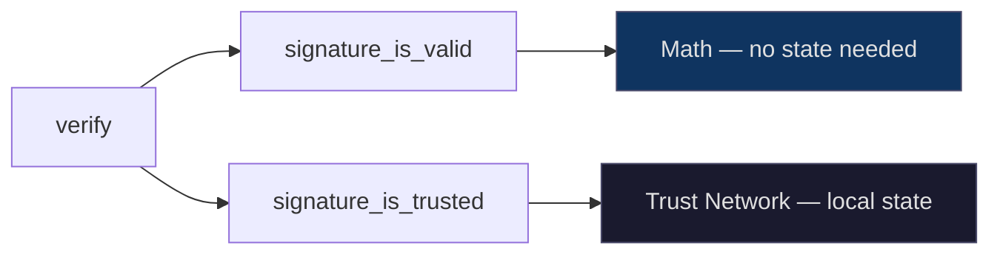
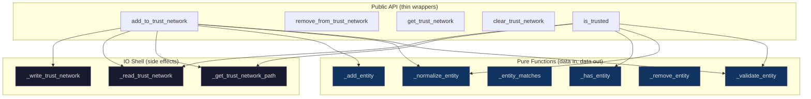

# Trust Network

> Local state that answers: "do I trust this signer?"

---

## The Gap: Valid ≠ Trusted

When you call `msd.verify()`, two fields tell you different things:

```python
result = msd.verify(signed_data)
result['signature_is_valid']    # Was the data tampered with? (math)
result['signature_is_trusted']  # Do I trust who signed it? (policy)
```

The first is pure cryptography — Ed25519 math and BLAKE3 hashes. It requires nothing beyond the data itself.

The second is a **policy question**. It requires the SDK to know who _you_ trust. That knowledge has to live somewhere persistent.



---

## What It Is

The trust network is a **local JSON file** listing entities you consider trustworthy. It's the simplest possible answer to the trust question: a flat list of accounts and organizations.

```json
[
  {"__type": "ET.GoogleAccount", "email": "alice@gmail.com"},
  {"__type": "ET.Organization", "url": "https://acme.com"},
  {"__type": "ET.GoogleAccount", "email": "bob@gmail.com"}
]
```

If a signer's identity is in this list, `signature_is_trusted` is `True`. If not, it's `False`. No ambiguity. No `None` state.

> [!info] Network sync is future work
> A connected user's trust network may eventually sync with the [[MSD Network]]. But the SDK works fully offline — local-first, network-optional.

---

## API

Five functions. All synchronous. All operate on a single JSON file.

### Add a trusted entity

```python
import msd_sdk as msd

msd.add_to_trust_network({'__type': 'ET.GoogleAccount', 'email': 'alice@gmail.com'})
msd.add_to_trust_network({'__type': 'ET.Organization', 'url': 'https://acme.com'})
```

Idempotent — adding the same entity twice is a no-op. Email matching is case-insensitive. URL matching strips trailing slashes.

### Remove a trusted entity

```python
msd.remove_from_trust_network({'__type': 'ET.GoogleAccount', 'email': 'alice@gmail.com'})
```

No-op if not present.

### Query the trust network

```python
msd.get_trust_network()
# [{'__type': 'ET.Organization', 'url': 'https://acme.com'}]

msd.is_trusted({'__type': 'ET.GoogleAccount', 'email': 'alice@gmail.com'})
# False (we just removed her)

msd.is_trusted({'__type': 'ET.Organization', 'url': 'https://acme.com'})
# True
```

### Clear everything

```python
msd.clear_trust_network()
msd.get_trust_network()  # []
```

---

## Tying It to Verify

The typical workflow:

```python
import msd_sdk as msd

# 1. Build a trust network (once, persists across sessions)
msd.add_to_trust_network({'__type': 'ET.GoogleAccount', 'email': 'alice@gmail.com'})

# 2. Receive signed data from somewhere
signed_data = receive_from_api()

# 3. Verify
result = msd.verify(signed_data)

if result['signature_is_valid']:
    signer = result.get('signer_identity')
    if signer and msd.is_trusted(signer):
        print("✅ Signed by someone you trust")
    else:
        print("⚠️ Valid signature, but signer not in your trust network")
else:
    print("❌ Data was tampered with")
```

> [!tip] Binary trust for v1
> The trust network is currently binary: present = trusted, absent = not trusted. Trust levels (high, medium, verified) are a planned extension — the store format supports adding a `trust_level` field to each entry without breaking existing files.

---

## Entity Types

Each entity uses MSD's typed-dict convention. The `__type` field determines the entity kind, and one field identifies it uniquely:

| Type | Identity Field | Example |
|------|---------------|---------|
| `ET.GoogleAccount` | `email` | `{'__type': 'ET.GoogleAccount', 'email': 'alice@gmail.com'}` |
| `ET.Organization` | `url` | `{'__type': 'ET.Organization', 'url': 'https://acme.com'}` |

> [!info] Extensible
> New entity types (e.g. `ET.GitHubAccount`, `ET.Domain`) can be added later without changing the store format.

### Matching Rules

Two entities are **the same** if they share the same `__type` and the same identity field value:

| Rule | Example |
|------|---------|
| Email is case-insensitive | `alice@gmail.com` matches `ALICE@Gmail.COM` |
| URL trailing slash stripped | `https://acme.com` matches `https://acme.com/` |
| Extra fields preserved | `{'__type': 'ET.GoogleAccount', 'email': '...', 'display_name': 'Alice'}` — the `display_name` is kept on disk |

---

## Where It's Stored

The trust network file lives alongside keys, under the MSD config root:

```
~/.config/msd/
├── keys/                      # Key files
│   ├── alice-identity.json
│   └── ci-key.json
└── trust-network.json         # Trusted entities
```

### Per-OS Paths

| OS | Path |
|----|------|
| **macOS** | `~/.config/msd/trust-network.json` |
| **Linux** | `$XDG_CONFIG_HOME/msd/trust-network.json` (default: `~/.config/msd/`) |
| **Windows** | `%APPDATA%\msd\trust-network.json` |

### Environment Variable Override

Set `MSD_TRUST_NETWORK` to point at a different file:

```bash
# Use a team-wide trust network in CI
MSD_TRUST_NETWORK=/etc/msd/trust-network.json python my_pipeline.py

# Use a temporary one for testing
MSD_TRUST_NETWORK=/tmp/test-trust.json python -m pytest
```

This is useful for:
- **CI/CD** — mount a shared trust network for your team
- **Testing** — use a temporary file without polluting your config
- **Docker** — set the path to where secrets are mounted

---

## File Format

Bare JSON array. No wrapper, no version field. Human-readable and easy to inspect:

```json
[
  {
    "__type": "ET.GoogleAccount",
    "email": "alice@gmail.com"
  },
  {
    "__type": "ET.Organization",
    "url": "https://acme.com"
  }
]
```

### Behavior

| Situation | What happens |
|-----------|-------------|
| No file exists | `get_trust_network()` returns `[]`, `is_trusted()` returns `False` |
| First `add_to_trust_network()` call | File and directory created automatically |
| `clear_trust_network()` | File deleted |
| Malformed JSON | `ValueError` with file path and parse error |
| File contains non-array JSON | `ValueError` — "must contain a JSON array" |
| Concurrent writes | Last writer wins (acceptable for personal config) |

Writes use **atomic rename** (`os.replace`) — the file is always valid JSON, never half-written.

---

## Architecture

The implementation follows Clojure-style separation: **pure functions for logic, thin IO shell at the edges**.



Pure functions are fully testable without disk access. The IO shell is minimal — three functions that read, write, or resolve a path.

---

## Related Notes

- [[Key Management]] — Keys stored alongside the trust network at `~/.config/msd/keys/`
- [[Verify API Design]] — How `signature_is_trusted` connects to the trust network
- [[Trust & Verification]] — Four layers of verification; trust network operating modes
