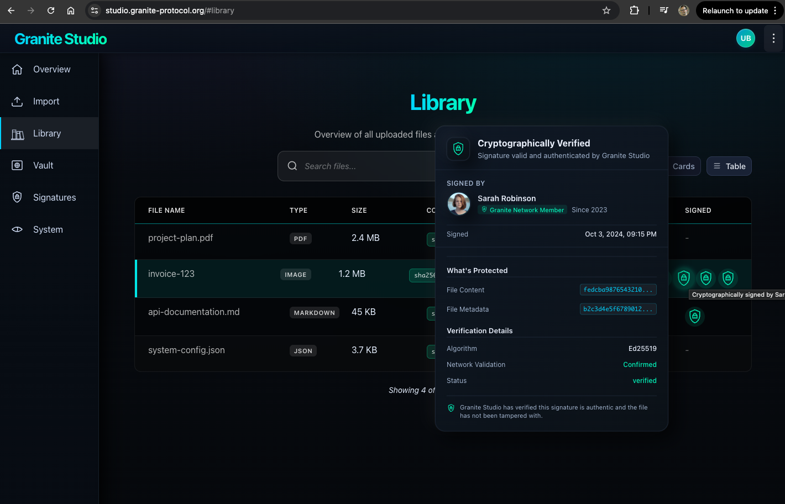

# User Facing MSD Python SDK

## Using MSD
There are 4 main ways for users to use MSD
- MSD Studio: a web app accessible under studio.metastructured.org
- MSD CLI: a command line interface for developers and power users
- MSD Desktop: a graphical desktop application for end users
- MSD SDKs: language-specific software development kits for developers to integrate MSD functionality into their own applications
    - MSD Python SDK
    - MSD JavaScript SDK (coming soon)
    - MSD Rust SDK (coming soon)


## Key Management
- a process running in prod typically has the public-private key pair for signing tokens accessible via an environment variable

### Creating a Key Pair
This can be done via the 
- certificate hierarchy: root can be MSD Foundation
- for company-wide internal provider system: a company master key pair can be issued by the MSDF


```python
import metastructured as msd


```



